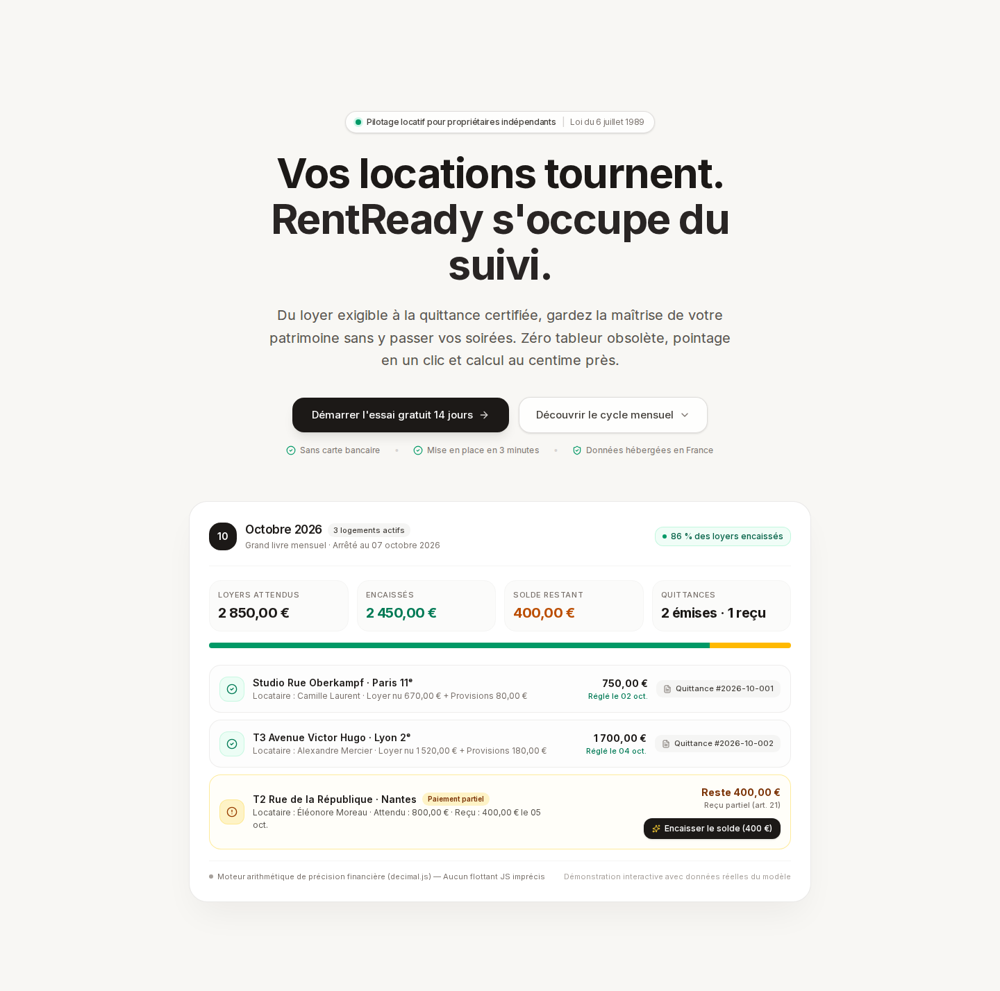
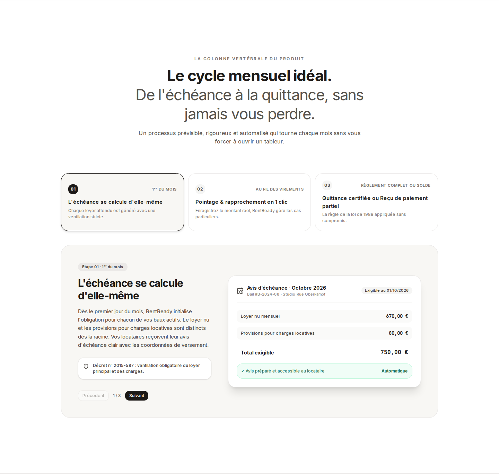
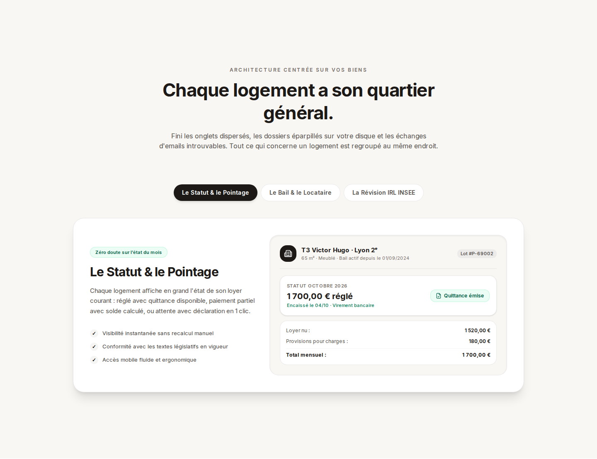
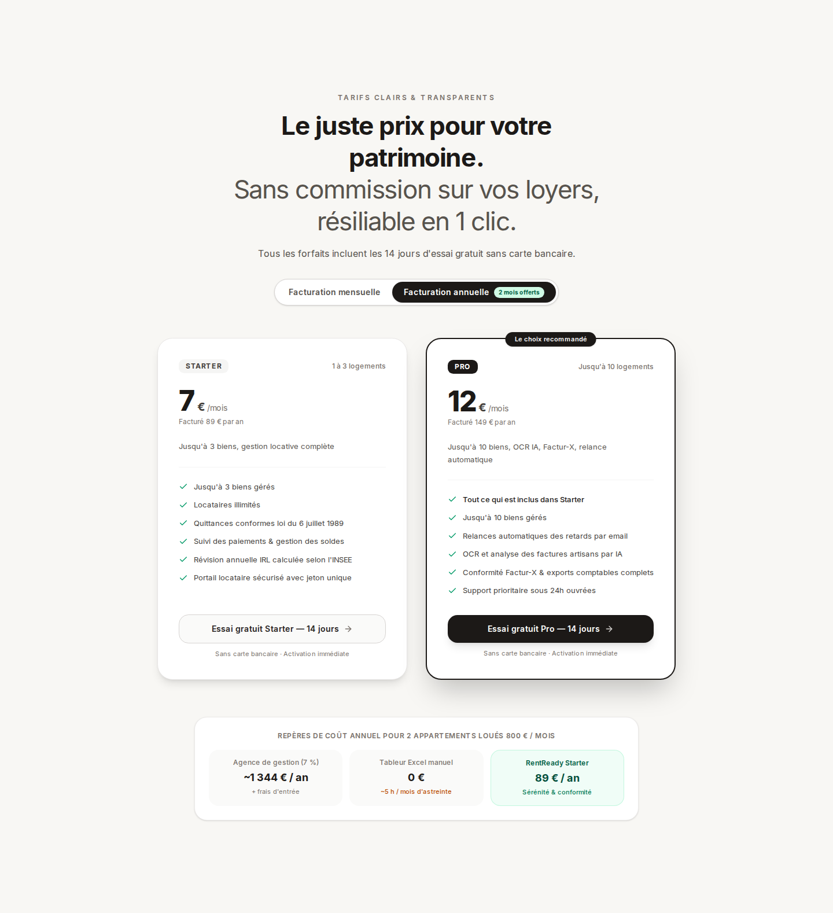
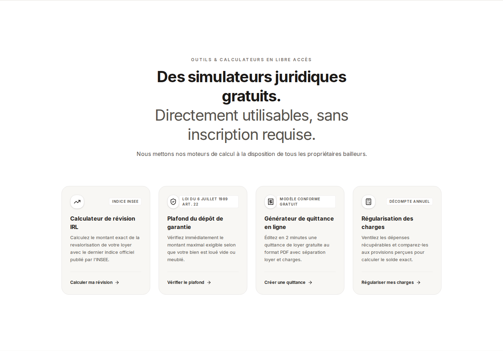

# Galerie Complète des Planches UI/UX — RentReady

Bienvenue dans la documentation visuelle de la refonte globale de RentReady.

Toutes les planches, captures d'écran multi-résolutions (Desktop, Tablette, Mobile) et rapports de conception sont regroupés ici pour consultation directe en local sur votre poste ou sur GitHub.

---

## Sommaire

0. [Arbitrage des 3 Directions Artistiques (Prototypage Réel)](#0-arbitrage-des-3-directions-artistiques)
1. [Surfaces Publiques & Marketing (Direction Sérénité Active V1)](#1-surfaces-publiques--marketing--direction-sérénité-active)
   - [Présentation Complète & Storytelling](./marketing/presentation.md)
   - [Galerie des Écrans Clés (Desktop 1440px)](#galerie-desktop-1440px)
   - [Responsive Viewports (Mobile, Tablette, Desktop)](#responsive-viewports)
2. [Refonte de l'Application (Tranches UX #1 à #4)](#2-refonte-de-lapplication-tranches-ux-1-à-4)
   - [Tranche #1 : Dashboard & Grand Livre Mensuel](#tranche-1--dashboard--grand-livre-mensuel)
   - [Tranche #2 : Property Home Base (4 états)](#tranche-2--property-home-base-4-états)
   - [Tranche #3 : Création de Bail Directe](#tranche-3--création-de-bail-directe)
   - [Tranche #4 : Onboarding & Activation Premier Bien](#tranche-4--onboarding--activation-premier-bien)
3. [Rapports Stratégiques & Audits](#3-rapports-stratégiques--audits)

---

## 0. Direction Retenue : B+ — « Editorial Monthly Ledger »

La synthèse retenue suite à la Creative Review :
* **Matière & Typographie de B :** Fond papier chaud (`#F7F5EE`), encre noire (`#181716`), filets d'imprimerie fins, titrage serif éditorial, absence totale de soupe de cartes.
* **Mécanique narrative de C :** Le cycle mensuel comme structure graphique (ouverture -> règlements -> exception isolée -> sérénité totale).
* **Clarté commerciale de A :** Bénéfice humain immédiat, compréhension dès les ~800 premiers pixels sur mobile et dans le premier viewport desktop.
* **Suppression du cosplay juridique :** Le droit protège silencieusement en sous-couche (art. 21), le vocabulaire reste simple, humain et direct.

| Support & État | Description | Lien vers la planche |
| :--- | :--- | :---: |
| **Desktop 1440px (Hero Viewport)** | Premier écran sans scroll : Promesse humaine + Grand livre ouvert | [Voir BPLUS_desktop_1440.png](./directions/BPLUS_desktop_1440.png) |
| **Desktop 1440px (Récit Complet)** | Récit mensuel complet avec exception Nantes mise en relief | [Voir BPLUS_desktop_full_story.png](./directions/BPLUS_desktop_full_story.png) |
| **Desktop 1440px (État Résolu)** | État après règlement : 100% encaissé, Nantes apaisé, 0 € restant | [Voir BPLUS_desktop_resolved_1440.png](./directions/BPLUS_desktop_resolved_1440.png) |
| **Mobile 390px (Hero Viewport)** | Premier écran mobile (~844px) : Titre, bénéfice, CTA et totaux | [Voir BPLUS_mobile_390.png](./directions/BPLUS_mobile_390.png) |
| **Mobile 390px (Récit Complet)** | Récit responsive complet et fluide du mois | [Voir BPLUS_mobile_full_390.png](./directions/BPLUS_mobile_full_390.png) |

---

## 0bis. Rappel des 3 Explorations Initiales (A, B, C)

Trois directions exploratoires initialement prototypées pour arbitrage :

| Direction | Concept & Signature | Arbitrage Creative Review |
| :--- | :--- | :---: |
| **Direction A** | The Calm Ledger / Control | Rejetée (trop standard SaaS, mais gardée pour sa clarté) |
| **Direction B** | L'Atelier Foncier & Typographique | **Retenue comme socle de marque & matérialité** |
| **Direction C** | Le Fil du Mois | **Retenue comme structure narrative du cycle** |

---

## 1. Surfaces Publiques & Marketing — Direction « Sérénité Active »
> Document détaillé : [Lire la présentation de Direction Artistique](./marketing/presentation.md)

### Galerie Desktop 1440px

#### 1. Hero Section & Grand Livre d'Octobre 2026

#### 2. Le Cycle Mensuel Idéal (Processus en 3 étapes)

#### 3. Property Home Base Showcase

#### 4. Grille Tarifaire Transparente (Starter & Pro)

#### 5. Simulateurs Juridiques Gratuits

---

### Responsive Viewports

| Format | Capture Pleine Page | Capture Au-dessus de la ligne de flottaison |
| :--- | :---: | :---: |
| **Mobile (390px)** | [Voir pleine page](./marketing/2_fullpage_mobile_390.png) | [Voir viewport](./marketing/1_hero_viewport_mobile_390.png) |
| **Tablette (768px)** | [Voir pleine page](./marketing/2_fullpage_tablet_768.png) | [Voir viewport](./marketing/1_hero_viewport_tablet_768.png) |
| **Desktop Moyen (1024px)** | [Voir pleine page](./marketing/2_fullpage_desktop_1024.png) | [Voir viewport](./marketing/1_hero_viewport_desktop_1024.png) |
| **Desktop Large (1440px)** | [Voir pleine page](./marketing/2_fullpage_desktop_1440.png) | [Voir viewport](./marketing/1_hero_viewport_desktop_1440.png) |

---

## 2. Refonte de l'Application (Tranches UX #1 à #4)

### Tranche #1 : Dashboard & Grand Livre Mensuel
*Dossier : `./app/slice1_dashboard/`*
* [Dashboard avec données (Desktop 1440)](./app/slice1_dashboard/06_dashboard_with_data_desktop_1440.png)
* [Dashboard avec données (Laptop 1280)](./app/slice1_dashboard/06_dashboard_with_data_laptop_1280.png)
* [Dashboard avec données (Mobile 390)](./app/slice1_dashboard/06_dashboard_with_data_mobile_390.png)
* [Dashboard état zéro / nouveau compte (Desktop)](./app/slice1_dashboard/05_dashboard_empty_desktop.png)
* [Dashboard état zéro / nouveau compte (Mobile)](./app/slice1_dashboard/05_dashboard_empty_mobile.png)

---

### Tranche #2 : Property Home Base (4 états)
*Dossier : `./app/slice2_property_homebase/`*

| État du Logement | Desktop 1440px | Mobile 390px |
| :--- | :---: | :---: |
| **Payé (Quittance disponible)** | [Desktop](./app/slice2_property_homebase/prop_paid_desktop_1440.png) | [Mobile](./app/slice2_property_homebase/prop_paid_mobile_390.png) |
| **En Retard / Impayé** | [Desktop](./app/slice2_property_homebase/prop_late_desktop_1440.png) | [Mobile](./app/slice2_property_homebase/prop_late_mobile_390.png) |
| **Paiement Partiel (Solde dû)** | [Desktop](./app/slice2_property_homebase/prop_partial_desktop_1440.png) | [Mobile](./app/slice2_property_homebase/prop_partial_mobile_390.png) |
| **Vacant (Bail requis)** | [Desktop](./app/slice2_property_homebase/prop_vacant_desktop_1440.png) | [Mobile](./app/slice2_property_homebase/prop_vacant_mobile_390.png) |

---

### Tranche #3 : Création de Bail Directe
*Dossier : `./app/slice3_bail/`*
* [Formulaire Desktop avec données](./app/slice3_bail/leases_new_desktop_1440.png)
* [Formulaire Desktop vide](./app/slice3_bail/leases_new_empty_desktop_1440.png)
* [Options avancées dépliées](./app/slice3_bail/leases_new_advanced_desktop_1440.png)
* [Formulaire Mobile avec données](./app/slice3_bail/leases_new_mobile_390.png)
* [Formulaire Mobile vide](./app/slice3_bail/leases_new_empty_mobile_390.png)

---

### Tranche #4 : Onboarding & Activation Premier Bien
*Dossier : `./app/slice4_onboarding/`*

| Étape du Parcours | Desktop 1440px | Mobile 390px |
| :--- | :---: | :---: |
| **1. Inscription** | [Desktop](./app/slice4_onboarding/1_register_desktop_1440.png) | [Mobile](./app/slice4_onboarding/1_register_mobile_390.png) |
| **2. Dashboard First-Run** | [Desktop](./app/slice4_onboarding/2_dashboard_empty_desktop_1440.png) | [Mobile](./app/slice4_onboarding/2_dashboard_empty_mobile_390.png) |
| **3. Modal Création Bien** | [Desktop](./app/slice4_onboarding/3_property_modal_desktop_1440.png) | [Mobile](./app/slice4_onboarding/3_property_modal_mobile_390.png) |
| **4. Home Base Bien Vacant** | [Desktop](./app/slice4_onboarding/4_property_homebase_vacant_desktop_1440.png) | [Mobile](./app/slice4_onboarding/4_property_homebase_vacant_mobile_390.png) |
| **5. Formulaire de Bail** | [Desktop](./app/slice4_onboarding/5_lease_new_desktop_1440.png) | [Mobile](./app/slice4_onboarding/5_lease_new_mobile_390.png) |
| **6. Home Base Activée** | [Desktop](./app/slice4_onboarding/6_property_homebase_activated_desktop_1440.png) | [Mobile](./app/slice4_onboarding/6_property_homebase_activated_mobile_390.png) |
| **7. Dashboard Activé** | [Desktop](./app/slice4_onboarding/7_dashboard_activated_desktop_1440.png) | [Mobile](./app/slice4_onboarding/7_dashboard_activated_mobile_390.png) |

---

## 3. Rapports Stratégiques & Audits

* **[Présentation Marketing Direction Sérénité Active](./marketing/presentation.md)** : Analyse DFII, inventaire des vérités produit, métriques MEASURED.
* **[Rapport de Clôture Tranche #4 (Onboarding)](./app/slice4_report.md)** : Métriques d'activation, tests E2E, gestion des plafonds légaux.
* **[Audit UX Initial](./app/audit_ux.md)** : Diagnostic des frictions de la version antérieure.
